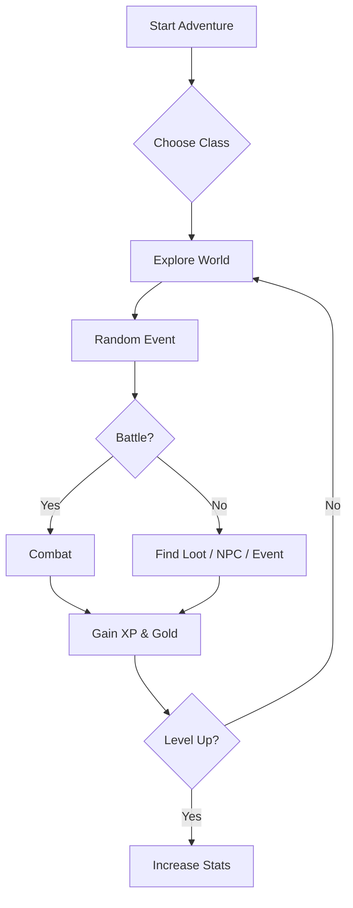

<p align="center">
  
  
  
</p>

<h1 align="center">🗡️ Text-Based RPG 🛡️</h1>
<p align="center">
  <b>Embark on an epic adventure in a world of monsters, loot, and endless possibilities—all from your terminal!</b>
</p>

---

## 🚀 Features

- **Create your own hero**: Choose a name and class!
- **Battle monsters**: Face off against dragons, skeletons, and more!
- **Inventory system**: Collect, equip, and use items.
- **Level up**: Gain XP, gold, and skill points.
- **Autosave**: Never lose your progress.
- **English language support**: Standard edition in English.
- **Modular codebase**: Easy to extend and maintain.

---

## 📊 Game Progress



---

## 🧙‍♂️ Playable Classes

| Class    | HP   | Vitality | Attack | Strength |
|----------|------|----------|--------|----------|
| Elf      | 110  | 1.0      | 18     | 1.3      |
| Demon    | 125  | 1.0      | 25     | 1.5      |
| Dwarf    | 150  | 1.3      | 15     | 1.3      |
| Orc      | 120  | 1.0      | 23     | 1.5      |
| Human    | 100  | 1.5      | 20     | 1.0      |
| Inchling | 80   | 1.5      | 15     | 1.5      |

---

## 🕹️ Quick Start

```bash
# Clone the repo
git clone https://github.com/yourusername/text_based_rpg.git
cd text_based_rpg

# Run the game
python -m __main__
```

---

## 🏹 Example Gameplay

```text
Welcome to your new adventure!
You wake up under a tree and don't remember anything...
New name: Arin

Choose a class:
1. Elf
2. Demon
3. Dwarf
...

What do you want to do?
1. Explore
2. Inventory
3. Save the game
4. Look at your stats
5. Settings
6. Quit
```

---

## 🗺️ Planned Features

- [ ] More events: dungeons, villages, NPC encounters
- [ ] Reworked inventory & weapon system (rarities, elements, durability)
- [ ] Respawn system
- [ ] Use inventory during combat
- [ ] Drop system
- [x] Autosave
- [x] English standard edition

---

## 🧩 Code Example

```python
def event_enemy_encounter(player):
    monster_data = Enemy.get_random_monster("normal")
    enemy = Enemy(monster_data)
    player.enemy_encounter(enemy)
```

---

## 📦 Project Structure

```text
text_based_rpg/
├── __main__.py         # Game entry point
├── classes.py          # Player, Enemy, Item classes
├── events.py           # Random events and encounters
├── lists_and_dicts.py  # Data for classes, monsters, items
├── README.md           # This file!
```

---

## 💡 Contributing

Pull requests are welcome! For major changes, please open an issue first to discuss what you would like to change.

---

## 📜 License

[MIT](LICENSE)

---

<p align="center">
  
</p>